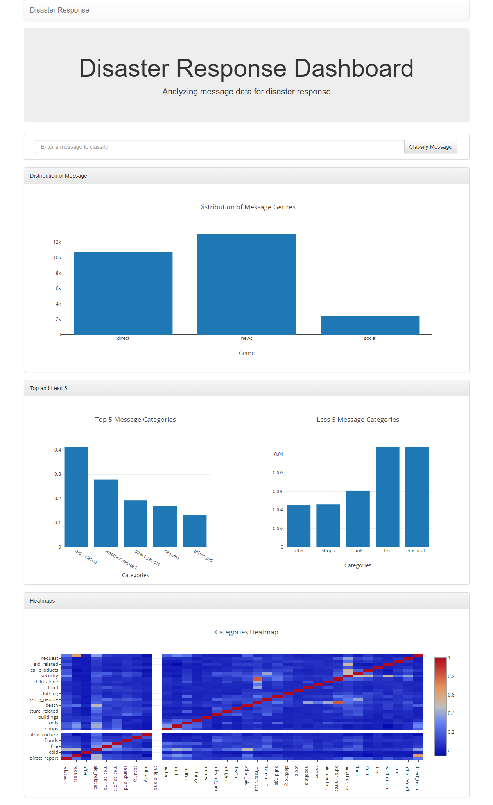
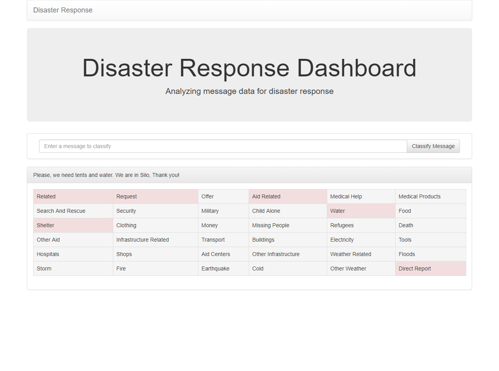

# Disaster Response Pipeline Project

### Table of Contents

1. [Summary ](#summary )
2. [Dependencies](#dependencies)
3. [Files Structure](#files)
4. [Instructions](#instructions)
4. [ScreenShots](#ScreenShot)

## Summary  
this repository contains helpers files to :
- load Figure Eight disaster data. 
- train, and save a machine learning model.
- classify disaster messages

## Dependencies 
You will need to add the following packages to the default anaconda packages
* sqlalchemy : conda install -c anaconda sqlalchemy 
* nltk : conda install -c anaconda nltk
* flask : conda install -c anaconda flask 

## Files Structure 

- data
    - process_data.py: A command line script to read, clean, and save data into a sqlLite database file.
- models
    - train_classifier.py: A command line script to create, train, and save a machine learning model to classify the provided data.
- app
    - run.py: An http server to serve the statistics and classifying web pages.
    - templates/go.html : classification page html file.
    - templates/master.html : statistics page html file.
    
    
## Instructions:
1. Run the following commands in the project's root directory to set up your database and model.

    - To run ETL pipeline that cleans data and stores in database
        `python data/process_data.py data/disaster_messages.csv data/disaster_categories.csv data/DisasterResponse.db`
    - To run ML pipeline that trains classifier and saves
        `python models/train_classifier.py data/DisasterResponse.db models/classifier.pkl`

2. Run the following command in the app's directory to run your web app.
    `python run.py`

3. Go to http://127.0.0.1:3001/

## ScreenShot:

###### Statistics page

###### Classification page

